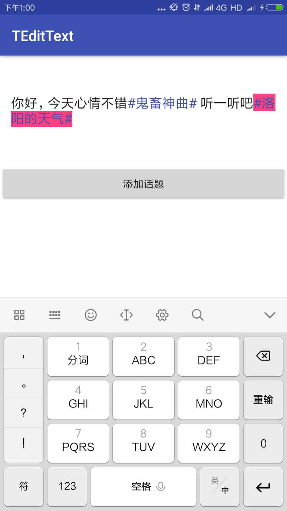

# TEditText
TEditText是一款可以添加话题可变色的编辑框，类似于微博的话题选择功能，选中一个话题，添加到编辑框里，话题将会变色，并且当删除话题的时候，会先选中然后再删除．
## 效果展示
如图１为添加话题后的UI效果，话题前景色和背景色可以任意设置． 

图１添加话题

如图２为删除话题时的UI效果，当第一次按删除键时，话题被选中，并显示用户设置的背景色，再按删除键，话题整体被删除． 

图2,话题被选中

## 如何使用

#### gradle

Step1. Add it in your root build.gradle at the end of repositories:
	allprojects {
		repositories {
			...
			maven { url 'https://jitpack.io' }
		}
	}

Step2.Add the dependency:
	dependencies {
	        compile 'com.github.Xiasm:TEditText:v1.0'
	}

### maven

	<repositories>
		<repository>
		    <id>jitpack.io</id>
		    <url>https://jitpack.io</url>
		</repository>
	</repositories>

Step 2. Add the dependency
	<dependency>
	    <groupId>com.github.Xiasm</groupId>
	    <artifactId>TEditText</artifactId>
	    <version>v1.0</version>
	</dependency>

## 在项目中使用
//话题对象，可继承此类实现特定的业务逻辑
        TObject object = new TObject();
        //匹配规则
        object.setObjectRule("#");
        //话题内容
        object.setObjectText(mStrings.get(i));
        mTEditText.setObject(object);

//　xml中使用
object_foreground_color：设置话题Object前景色
object_background_color：设置话题Object背景色
	<com.xsm.library.TEditText
        android:id="@+id/edittext"
        android:inputType="textMultiLine"
        android:minLines="5"
        android:hint="@string/hint"
        android:background="@null"
        android:layout_margin="15dp"
        app:object_foreground_color="@color/colorPrimary"
        app:object_background_color="@color/colorAccent"
        android:layout_width="match_parent"
        android:layout_height="120dp"/>

